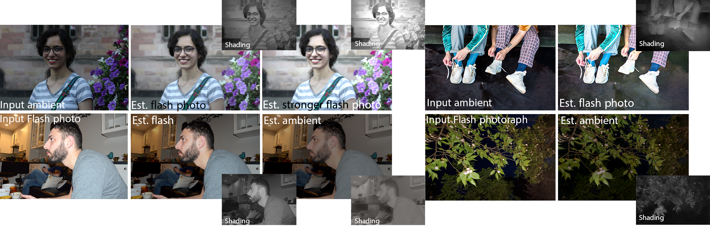

# Computational Flash Photography through Intrinsics


## Setup
We provide the implementation of our method for both the generation and decomposition of flash through intrinsics.
### Environments
Our model can be trained using python 3.9 or higher versions.

Download our models weights from [here](https://vault.sfu.ca/index.php/s/sRWFTyRkirFEw6B) and put it in the checkpoints.

Install the following dependencies:
```sh
conda install pytorch torchvision pytorch-cuda=11.6 -c pytorch -c nvidia
conda install matplotlib
conda install scipy
conda install scikit-image
conda install -c conda-forge pymatreader
conda install -c conda-forge dominate
conda install -c conda-forge timm
pip install opencv-python

```

### Training
Navigate to [dataset preparation instructions](./dataset_prepare/) to download and prepare the training dataset. 

For decomposition:
```sh
python train.py --dataroot DATASETDIR --name flashDecomposition --model intrinsic_flash_decomposition  --normalize_flash 1 --normalize_ambient 1   
```
For generation:
```sh
python train.py --dataroot DATASETDIR --name flashGeneration --model intrinsic_flash_generation  --normalize_flash 1 --normalize_ambient 1  
```


### Evaluation
For decomposition:
```sh
python test.py --dataroot DATASETDIR --name flashDecomposition --model intrinsic_flash_decomposition  --normalize_flash 1 --normalize_ambient 1 --eval 
```
For generation:
```sh
python test.py --dataroot DATASETDIR --name flashGeneration --model intrinsic_flash_generation  --normalize_flash 1 --normalize_ambient 1  --eval
```


## Citation
This implementation is provided for academic use only. 

Please cite our paper if you use this code or any of the models.
## Credits
The training skeleton is adaptod from the [pytorch-CycleGAN-and-pix2pix][4] repository.

The network architecture is adopted from the [MiDaS][1] repository.

[1]: https://github.com/intel-isl/MiDaS/tree/v2
[4]: https://github.com/junyanz/pytorch-CycleGAN-and-pix2pix