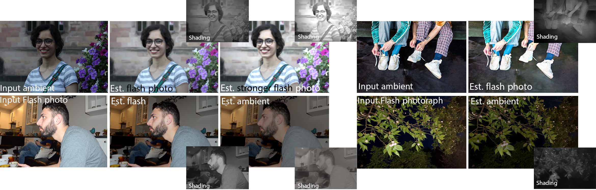

# Computational Flash Photography through Intrinsics


We develop a system to computationally control the flash light in photographs originally taken with or without flash. We formulate the flash photograph formation through image intrinsics, and estimate the flash shading through generation for no-flash photographs (top) or decomposition where we separate the flash from the ambient illumination for flash photographs (bottom).

Project web page: http://yaksoy.github.io/intrinsicFlash

Extended Flash and Ambient Illuminations Dataset repo: https://github.com/compphoto/IntrinsicFlashDataset

## Setup
We provide training implementation of our method for both the generation and decomposition of flash through intrinsics.

### Environments
Our model can be trained using python 3.9 or higher versions.

Download our models weights from [here](https://vault.sfu.ca/index.php/s/sRWFTyRkirFEw6B) and put it in a directory called checkpoints.

Install the following dependencies:
```sh
conda install pytorch torchvision pytorch-cuda=11.6 -c pytorch -c nvidia
conda install matplotlib
conda install scipy
conda install scikit-image
conda install -c conda-forge pymatreader
conda install -c conda-forge dominate
conda install -c conda-forge timm
pip install opencv-python

```

### Training
Navigate to [dataset preparation instructions](./dataset_prepare/) to download and prepare the training dataset. 

For decomposition:
```sh
python train.py --dataroot DATASETDIR --name flashDecomposition --model intrinsic_flash_decomposition  --normalize_flash 1 --normalize_ambient 1   
```
For generation:
```sh
python train.py --dataroot DATASETDIR --name flashGeneration --model intrinsic_flash_generation  --normalize_flash 1 --normalize_ambient 1  
```


### Evaluation
For decomposition:
```sh
python test.py --dataroot DATASETDIR --name flashDecomposition --model intrinsic_flash_decomposition  --normalize_flash 1 --normalize_ambient 1 --eval 
```
For generation:
```sh
python test.py --dataroot DATASETDIR --name flashGeneration --model intrinsic_flash_generation  --normalize_flash 1 --normalize_ambient 1  --eval
```


## Citation
This implementation is provided for academic use only. 
```
@INPROCEEDINGS{maralan2023flash,
  author={Sepideh Sarajian Maralan and Chris Careaga and Ya\u{g}{\i}z Aksoy},
  title={Computational Flash Photography through Intrinsics},
  journal={Proc. CVPR},
  year={2023}
}
```

Please cite our paper if you use this code, dataset or any of the models.
## Credits
The training skeleton is adapted from the [pytorch-CycleGAN-and-pix2pix][4] repository.

The network architecture is adapted from the [MiDaS][1] repository.

[1]: https://github.com/intel-isl/MiDaS/tree/v2
[4]: https://github.com/junyanz/pytorch-CycleGAN-and-pix2pix
